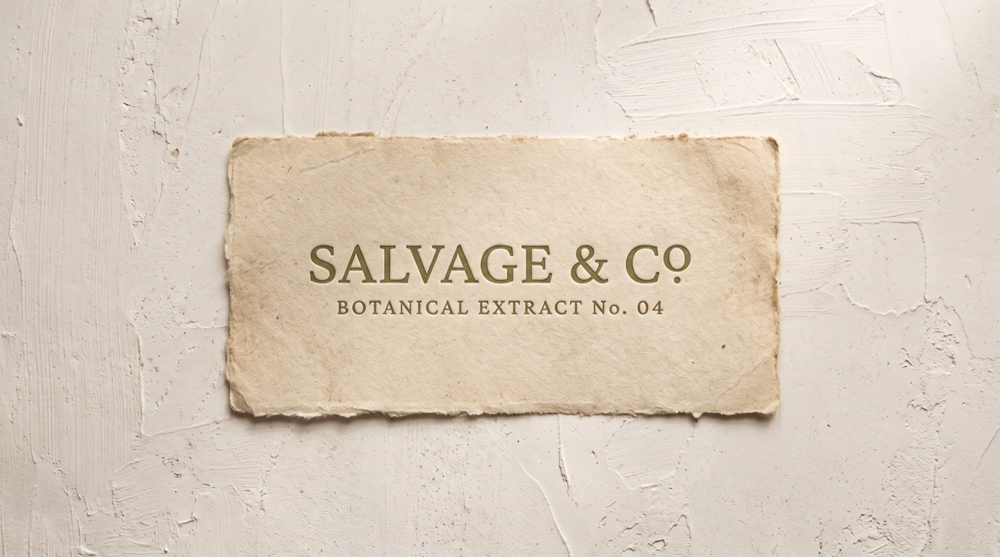
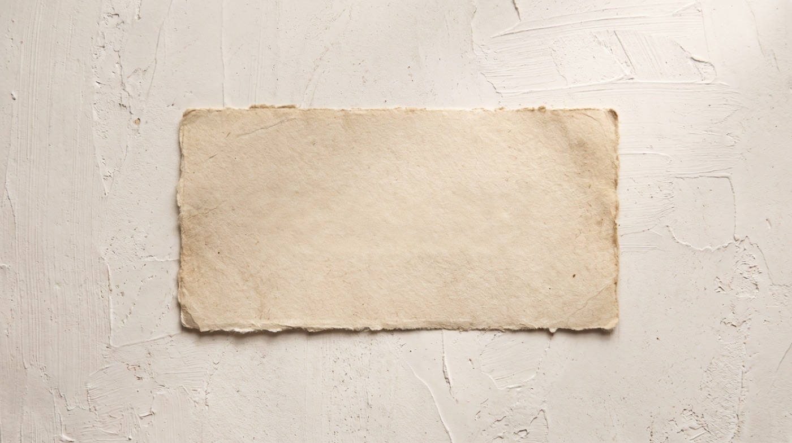
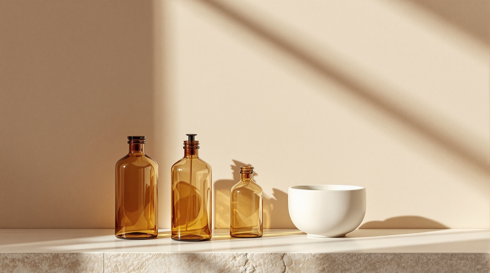
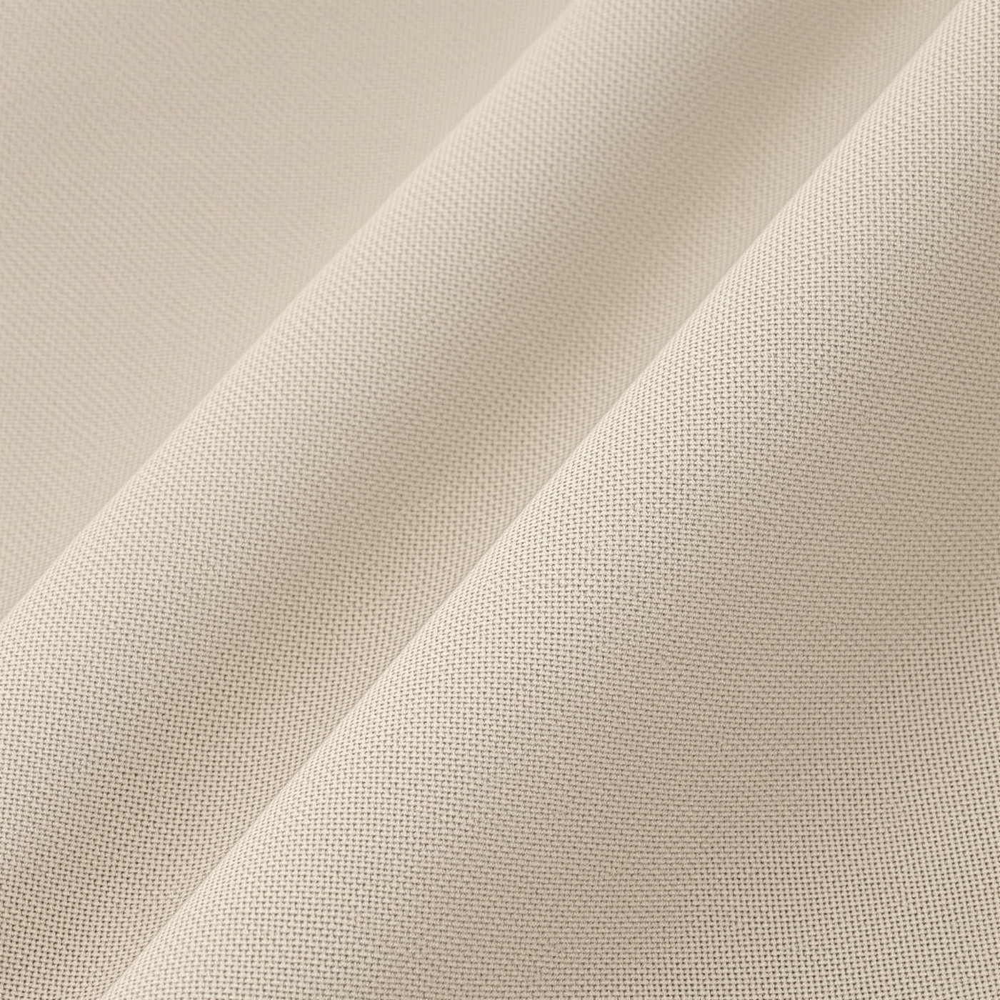
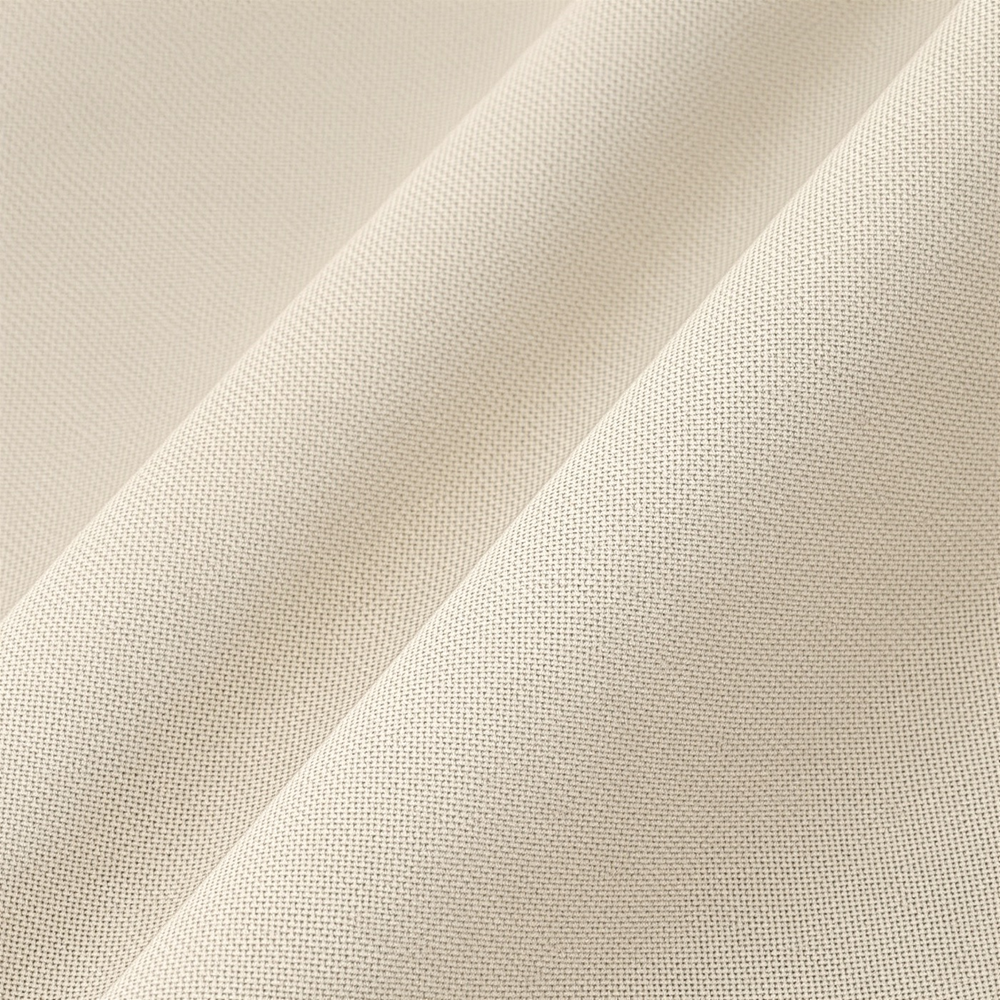
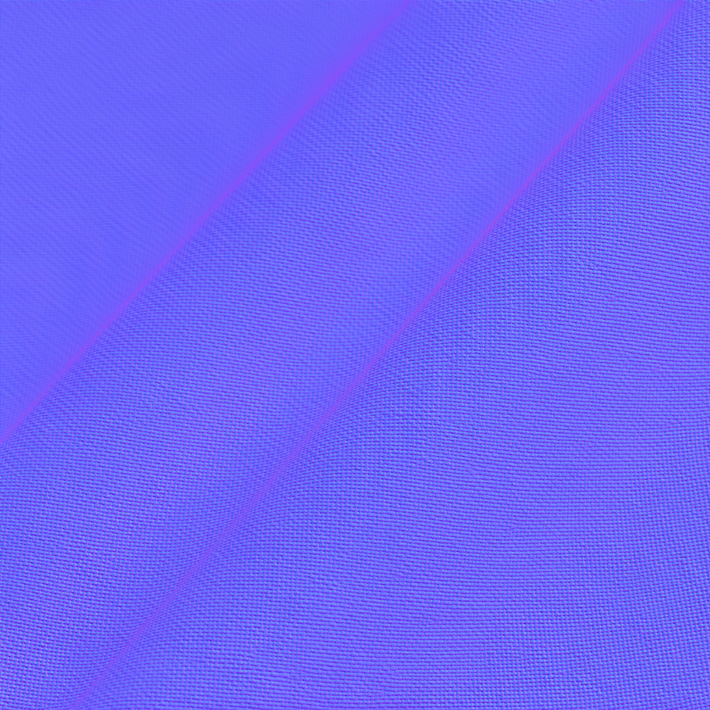
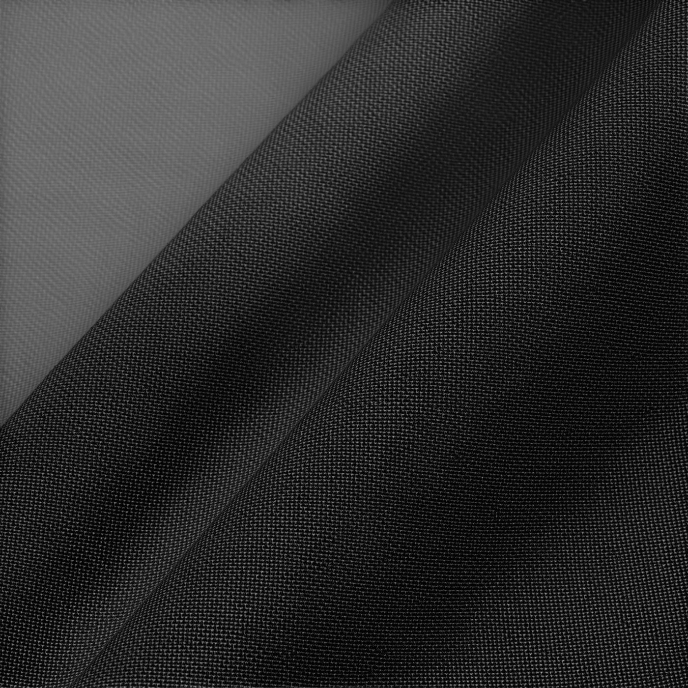

# Layers, vectors and materials

Three families that take a flat image apart into something you can work with afterwards: type you can reset, objects you can re-compose, paths you can scale, and surface maps you can light.

## Layerize is not what the name says

The obvious reading of `layerize-text` is that it hands back RGBA layers, like a PSD. It doesn't, and the gap between the name and the behaviour is the single most useful thing on this page.

`ideogram-layerize-text` declares four outputs: `image_layers`, `image`, `text_html` and `text_containers`. Run it on a piece of typography and what you get is:

- **`image`** - the source with the type lifted off and what sat behind it rebuilt.
- **`text_containers`** - the type as structured data. One entry per text run, with its pixel position, its alignment, and candidate fonts.
- **`text_html`** - a positioned HTML reconstruction of the type, ready to render over the plate.
- **`image_layers`** - which, on a text-only source, came back **empty**.

```bash
motif tool run ideogram-layerize-text source-label.jpg -o layers/
```

| Source | `layers/image.jpg` |
| --- | --- |
|  |  |

The deckle edge, the paper grain, the fibre flecks and the plaster behind are all still there. Only the type is gone - and it isn't lost, it's in `text_containers` with the coordinates it came from.

**So `layerize-text` is a re-typesetting tool.** You use it when you have a rendered design and you want to change the words: take the plate, take the positions and fonts, set new copy, composite. That is a real job, and it is not "give me PSD layers".

$0.09 an image, queued.

### The tools that do return layers

| Tool | Returns | Price |
| --- | --- | --- |
| `qwen-layered` | `images` - stacked RGBA layers | metered, listed at $0.05/image, queued |
| `seedream-layerize` | A named, z-ordered object stack in `layers`, plus flattened `images` | metered - per generated layer, queued |

fal lists `qwen-layered` at $0.05 per image but does not say whether that counts the
image you send or each of the layers it returns. Rather than assert a per-call price on
the more favourable reading, the registry reports no estimate - `estimatedCost` comes
back `null` and the listed rate stays in `pricing` for you to judge.

`motif layers` is the promoted verb over `qwen-layered`:

```bash
motif layers poster.png -o layers/
```

`-o` **must** end in a slash. One file per layer means one directory, and passing a filename is an `INVALID_OPTION` error rather than a silent overwrite.

### seedream-layerize takes the scene apart

The shared word "layerize" hides the fact that these two tools do opposite jobs. `ideogram-layerize-text` extracts *type*. `seedream-layerize` extracts *objects* - and it names them.

```bash
motif tool run seedream-layerize source-apothecary.jpg -o layers/
```

Run against the apothecary still life, it returns a five-layer stack:

| `z_index` | `name` | Bounding box |
| --- | --- | --- |
| 0 | the background plate | full frame |
| 1 | Left amber glass bottle | 327,388 → 453,686 |
| 2 | Middle amber glass pump bottle | 488,382 → 606,692 |
| 3 | Small right amber glass bottle | 656,475 → 752,681 |
| 4 | White ceramic bowl | 822,527 → 1047,680 |



Two things make that more useful than a flat RGBA split.

**Layer 0 is a reconstructed empty set.** Every object removed and the surface behind it inpainted - the plaster wall, the travertine ledge and the raking light all intact. It's the scene with the props taken out, which is the hardest thing to get any other way.

**Each object layer is cropped to its own bounding box on transparency**, and carries a human-readable `name` and `description` alongside `z_index` and both absolute and normalised coordinates.

So you get a still life you can re-compose. Move the bowl, drop a bottle, swap the background - no regeneration, no masking by hand.

**One thing to know today: the filenames are positional, the names are not.** Files download as `layers.png`, `layers-2.png`, `layers-3.png` and so on, in z-order. The `name` for each is in the JSON response, not on disk, so read the response to know which file is which. Tracked as MOT-41.

Billing is per generated layer, not per call - $0.03375 a layer below 1536x1536 total area, $0.0675 above - so `estimatedCost` comes back `null`. The five-layer decomposition above is five times the unit price, and the CLI cannot know the layer count before it runs.

## Vector

Two tools, and the choice is about what you want the SVG to be.

| Tool | Output | Price | Character |
| --- | --- | --- | --- |
| `recraft-vectorize` | One clean `image` SVG | $0.04, $0.08 with a vector style | Few paths, tidy curves, editable |
| `image2svg` | Layered `images` SVG | $0.005 | Traced, many paths, faithful to pixels |

`motif vectorize` is the verb over `recraft-vectorize`:

```bash
motif vectorize logo.png -o logo.svg
```

`-o` must name a `.svg` or end in a slash. Without it the CLI would derive a `.png` filename and write SVG markup into it, so it refuses instead.

### Generate, then vectorise

The pairing that makes this useful is generating a mark with a model that draws cleanly and then converting it. Recraft is the generation model built for design and vector work, so it is the natural front half:

```bash
motif "a minimal letterpress wordmark, SALVAGE & CO, single weight serif, flat black on white" \
  -m recraft --square --no-open --format json --fields path
motif vectorize <that path> -o wordmark.svg --no-open
```

$0.04 to generate, $0.04 to vectorise. Worth generating three or four candidates at $0.04 each and vectorising only the one you keep - the raster pass is where the design decision happens, and the vector pass is mechanical.

`recraft-vectorize` is $0.08 rather than $0.04 when a vector style is applied. `image2svg` at $0.005 is the one to reach for when you want a literal trace of a photograph rather than a clean mark.

## Materials

Four tools that turn a surface photograph into something a renderer can light.

| Tool | Job | Price |
| --- | --- | --- |
| `patina` | Decompose a surface into PBR maps | metered, queued |
| `patina-extract` | Extract a *tiling* material from a prompted region | metered, queued |
| `ideogram-tiling` | Generate a seamlessly tiling texture | $0.06/MP |
| `seedvr-seamless` | Upscale a tiling texture, keeping the seams | $0.0025/MP, queued |

### Photo to PBR

```bash
motif tool run patina source-linen.jpg -o pbr/
```

`patina` returns its five maps in one `images` array, and the registry declares what each position is. The CLI applies those names, so `-o pbr/` writes:

```
pbr/basecolor.jpg
pbr/normal.jpg
pbr/roughness.jpg
pbr/metalness.jpg
pbr/height.jpg
```

Not `images-2.jpg` through `images-5.jpg`, which is what you get from an array output with no declared order and which tells you nothing about which map is which.

| Source | `basecolor.jpg` | `normal.jpg` | `roughness.jpg` |
| --- | --- | --- | --- |
|  |  |  |  |

Two things worth noticing in those maps.

The **basecolor** is noticeably flatter than the source. The bright fold running across the top left has been largely de-lit, which is the job.

The **roughness** map has not fully escaped it. That same fold still reads as a lighter band across an otherwise near-black map - baked lighting from the photograph leaking into a channel that should only describe the surface. If you care about that, run [`remove-lighting`](repair-and-restore.md#lighting) over the photograph first at $0.035/MP and feed the flattened version to `patina`.

### A reordered `maps` is honoured

If you only want two maps, or you want them in a different order, pass the `maps` option and the filenames follow the request rather than the schema default:

```bash
motif tool run patina source-linen.jpg --json '{"maps":["normal","basecolor"]}' -o pbr/
```

That writes `pbr/normal.jpg` and `pbr/basecolor.jpg`, named from what you asked for. The naming falls back to the schema order only when you don't set the option, and it is dropped entirely if the label count doesn't match the number of URLs that came back - a mislabelled map reads as authoritative and is worse than a positional one.

**`patina` is metered.** Its real cost is $0.01 base plus $0.01 per megapixel *per output map*, so all five maps on a 1MP source is about $0.06 - and asking for two maps is genuinely cheaper than asking for five. No flat number can express that, so `estimatedCost` is `null`.

### Tiling materials

`patina-extract` does a different job: you point at a region of a photograph and it extracts a *tiling* material from it, rather than decomposing the frame you gave it.

```bash
motif tool run patina-extract source-linen.jpg --prompt "the linen weave" -o material/
```

Metered - $0.10 base, plus $0.02/MP and $0.01/MP per map, so 1MP with all five maps is around $0.17. Same output labelling as `patina`.

`ideogram-tiling` generates a tiling texture outright, optionally conditioned on a source image, at $0.06 per megapixel ($0.03 turbo, $0.10 quality). `seedvr-seamless` enlarges a tile you already have while keeping its edges seamless, at $0.0025 per megapixel - a plain upscaler would break the tiling, which is the whole reason it exists.

```bash
motif tool run ideogram-tiling source-linen.jpg -o tile.png
motif tool run seedvr-seamless tile.png -o tile-2k.png
```

## Costs on this page

Most of these report `estimatedCost: null`:

| Tool | Why it's null |
| --- | --- |
| `patina`, `patina-extract` | Billed per megapixel *per map*, and the map count is a request option |
| `seedream-layerize` | Billed per generated layer, and the layer count isn't known until it runs |
| `ideogram-tiling`, `seedvr-seamless` | Billed per megapixel of output |

Only `qwen-layered` ($0.05), `ideogram-layerize-text` ($0.09), `recraft-vectorize` ($0.04) and `image2svg` ($0.005) have a flat per-call price and report a number.

`null` is not free. It means the bill depends on something the CLI cannot see before the call - output size, map count, layer count. The `pricing` string in the dry run carries the real formula; read it and do the multiplication yourself.

```bash
motif tool describe patina --format json
```

---

- [Understanding images](understanding-images.md) - segment, ask, OCR
- [Repair and restore](repair-and-restore.md) - flatten the lighting before extracting maps
- [Pipelines](pipelines.md) - generate then vectorise, photo then PBR
