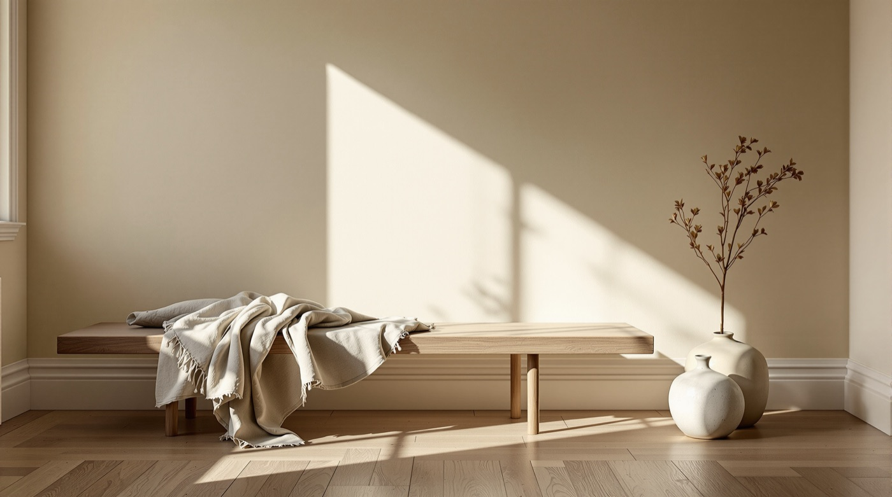
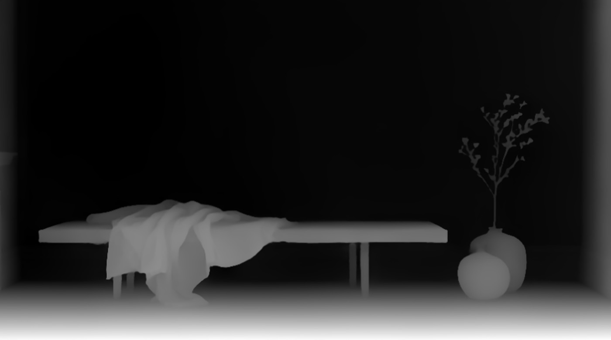
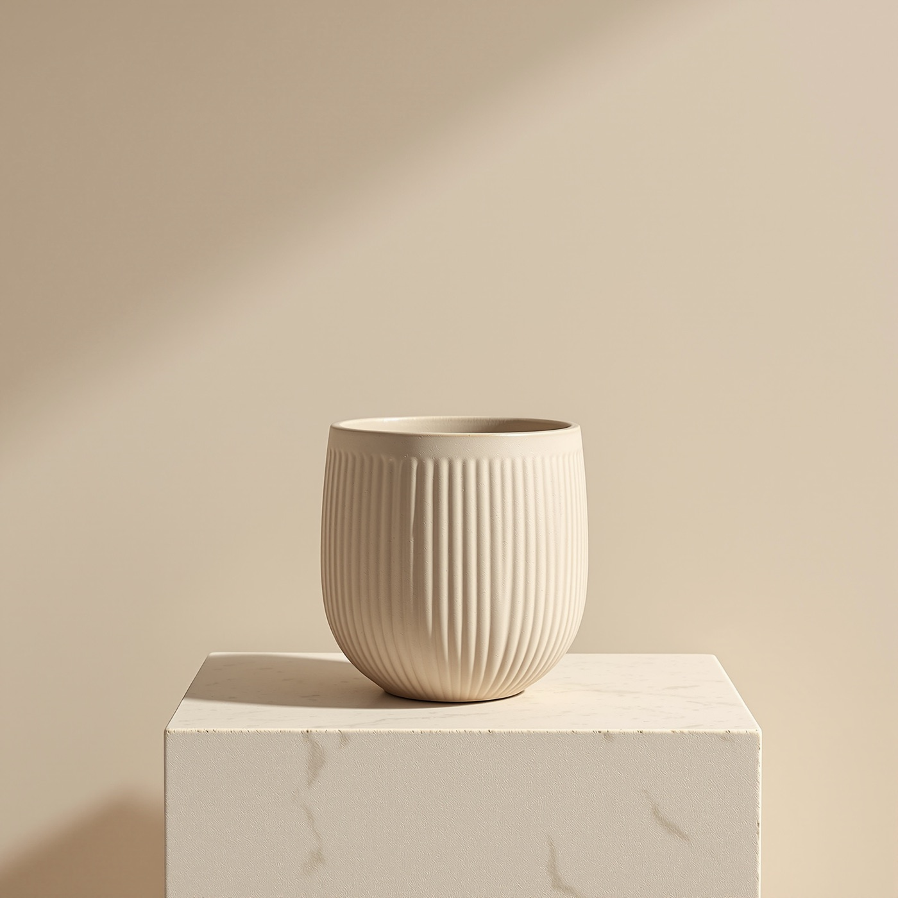
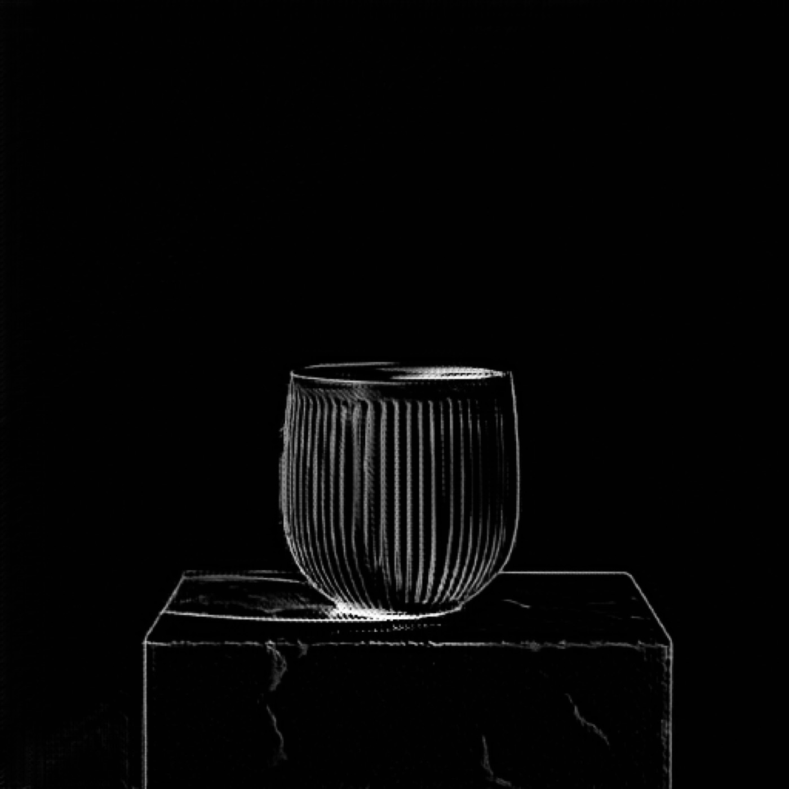

# Preprocessors

Thirteen tools that turn a photograph into a control map: a depth map, a pose skeleton, an edge drawing. None of them produce a finished image. Each one produces the input to a *conditioned* generation - the thing you hand a model when you want the new image to keep the old one's geometry.

The question this page answers is which one to reach for. They are not interchangeable, and picking the wrong family is why conditioned output comes back looking approximately right and structurally wrong.

## Where the map goes afterwards

Motif has no ControlNet generation endpoint of its own. The control map is a file; you consume it in one of two places:

- **As a reference image to an edit-capable model.** `motif "..." --edit depth.png -m banana` passes it as visual context. Loose, no hard geometric constraint, but it needs nothing outside Motif.
- **As the control input to a ControlNet pipeline.** ComfyUI, diffusers, or a fal ControlNet endpoint called directly. This is where the map does what it was designed to do - the generation is constrained to the geometry, not merely nudged by it.

The map types below are the standard ControlNet ones, so a depth map from `depth-anything` drops straight into a depth ControlNet, a `dwpose` skeleton into an OpenPose one, and so on.

## Depth - keep the layout, change everything else

Depth is the map to reach for when the composition is right and the surfaces are wrong: same room, different materials; same product on the shelf, different finish.

```bash
motif tool run depth-anything source-interior.jpg -o out-depth.jpg --no-open
```

| Source | Depth map |
| --- | --- |
|  |  |

Near is light, far is dark. The bench, the folds of the linen and the vase survive; the colour, the light and the wood grain do not. That is the point - what the depth ControlNet reproduces is exactly what is left in this image.

Five tools produce depth, and they differ in what the greys mean:

| Tool | Output | Reach for it when |
| --- | --- | --- |
| `depth-anything` | `image` | The default. Depth Anything v2, robust across scene types |
| `zoe-depth` | `image` | You need *metric* depth - greys that correspond to real distance, not just relative order |
| `midas-preprocessor` | `depth_map`, `normal_map` | You want a surface normal map as well, in one call. `-o dir/` writes both |
| `marigold-depth` | `image` | Diffusion-based, slower and often cleaner on hard edges. `--ensemble-size` (min 2) and `--num-inference-steps` trade time for stability |
| `midas-depth` | `image` | The MiDaS utility endpoint, with `a` and `bg_th` tuning rather than the preprocessor family's flags |

All five are metered - `estimatedCost` comes back `null`, and fal lists them at $0/compute-second.

## Pose - keep the figure, change the scene

`dwpose` extracts body, hand and face skeletons. It is the map for character consistency: same stance, same gesture, new setting or new style.

```bash
motif tool run dwpose figure.jpg -o pose.png --no-open
```

It is the one preprocessor with a real per-unit rate - $0.0006 per compute second - so a dry run reports `estimatedCost: null` with `estimatedCostPerSecond: 0.0006` beside it. Cheap, but not free like the metered ones.

Pose is the wrong tool for objects. A skeleton of a chair is nothing; use depth or edges.

## Edges - keep the drawing, change the rendering

Six edge tools, and the difference between them is how hard the line is. This is the family for style transfer: hold the structure, replace everything about how it looks.

```bash
motif tool run lineart source-vessel.jpg -o out-lineart.jpg --no-open
```

| Source | Line art |
| --- | --- |
|  |  |

Every rib on the vessel and every fracture in the plinth is there. The light, which is most of what makes the photograph, is gone.

| Tool | Line character | Reach for it when |
| --- | --- | --- |
| `lineart` | Clean, drawn, high detail | Style transfer where the subject reads as illustrated. `--coarse` gives a looser line |
| `hed` | Soft, painterly, follows tone | You want the edges to carry some shading, not just outline |
| `pidi` | Soft, lighter than HED | HED is picking up too much texture |
| `teed` | Thin and even | You want consistent line weight across the frame |
| `scribble` | Loose and sparse | You want the model to invent most of it and only honour the gesture |
| `mlsd` | Straight line segments only | Architecture and interiors. It finds walls, frames and floorboards and discards everything organic |

`mlsd` is the specialist worth remembering. On an interior it returns the room's geometry and nothing else, which is exactly right for architectural work and useless on a portrait.

## Segmentation map

`sam-preprocessor` produces a segmentation map - flat regions rather than lines or greys - for segmentation-conditioned ControlNets. It is a preprocessor, not a segmenter: if you want a named object cut out, use `motif segment`, covered in [Understanding images](understanding-images.md).

## Picking one

- Layout must survive, surfaces must change → **depth-anything**
- Real-world distances matter → **zoe-depth**
- A person's stance must survive → **dwpose**
- A drawing must survive, rendering must change → **lineart**
- The building must survive → **mlsd**
- You want the gesture only → **scribble**
- You need depth and normals in one call → **midas-preprocessor**

## Costs and timing

Every preprocessor here runs synchronously - none is marked `queued`. All are metered except `dwpose`.

Metered means `estimatedCost` is `null` in both the dry run and the result. That is not zero. Read [the cost section of the CLI guide](../../apps/cli/AGENTS.md#cost-reference) before you assume a null is free.

```bash
motif tool run depth-anything source-interior.jpg --dry-run --format json
# {"estimatedCost":null,"pricing":"$0/compute-second listed by fal","queued":false,...}
```

---

- [Understanding images](understanding-images.md) - segment, ask, OCR
- [Layers, vectors and materials](layers-vectors-materials.md) - PBR maps from a photograph
- [Pipelines](pipelines.md) - chaining these together
