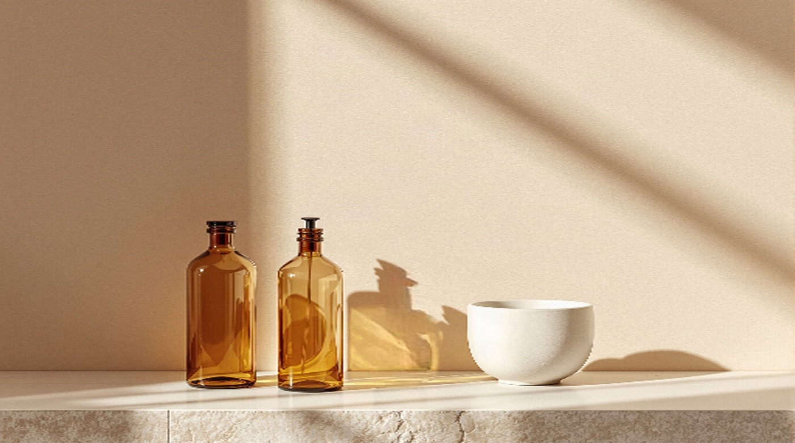
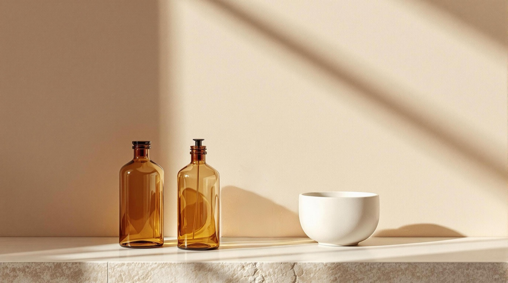
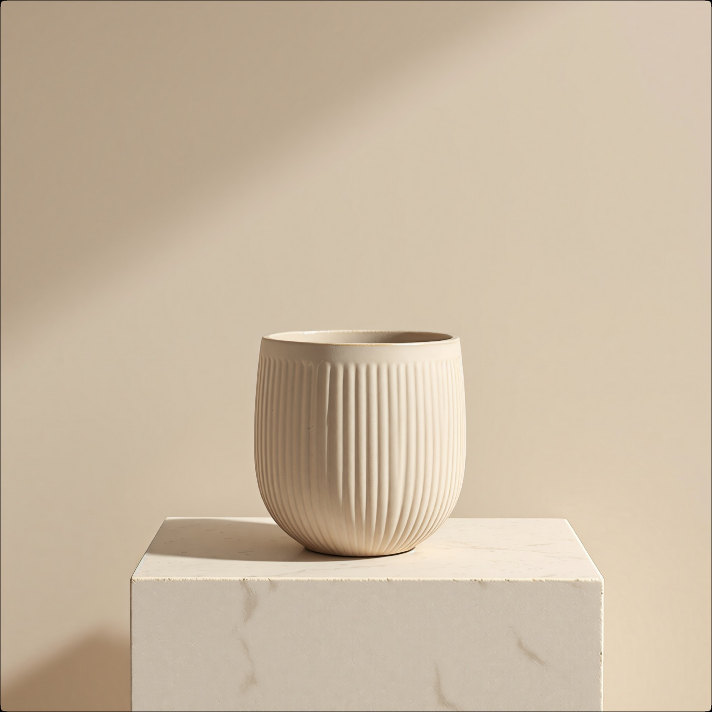

# Repair and restore

Something in the frame is wrong and you want it gone, or something about the whole frame is degraded and you want it back. Those are different jobs with different tools, and the registry carries several of each because the cheap one and the expensive one fail in different places.

Start here:

| The problem | Reach for | Price |
| --- | --- | --- |
| An object is in the shot | `motif erase "<the thing>"` | $0.024 |
| An object is in the shot **and casts a shadow** | `finegrain-eraser` | $0.27 |
| You have a mask, not a phrase | `bria-eraser` or `object-removal-mask` | $0.04 / $0.024 |
| You want something *else* in that region | `bria-genfill` | $0.04 |
| Rendered text needs to come off | `text-removal` | $0.04 |
| The photograph is soft, noisy or damaged | `motif enhance --restore` and friends | $0.08 to $0.96 per 24 output megapixels |
| The lighting is wrong | `remove-lighting`, `lighting-restoration`, `iclight-v2` | $0.035/MP to $0.10/MP |
| It's black and white | `ddcolor` | $0.001/MP |

## The shadow is the whole argument

`motif erase` runs `object-removal` at $0.024. It removes the object. It does not remove what the object was doing to the light.

Here is the same source through both erasers, asked to remove the small amber bottle:

```bash
motif erase "the small amber bottle on the right of the group" source-apothecary.jpg -o out-erased.jpg --no-open
motif tool run finegrain-eraser source-apothecary.jpg --prompt "the small amber bottle on the right of the group" -o out-erased-finegrain.jpg
```

(`motif tool run` has no `--no-open` flag and never opens a viewer. The seven promoted verbs do open one by default, so they need it in a pipeline.)

**Source**


**`object-removal`, $0.024**



**`finegrain-eraser`, $0.27**



Look at the wall to the right of the two remaining bottles. In the $0.024 version the bottle's cast shadow is still there, along with the amber caustic it threw onto the shelf - a shadow with nothing making it. In the $0.27 version the wall is clean and the light falls the way it would have if the bottle had never been on the shelf.

That is the difference the eleven-fold price buys, and it is the only difference that matters. Neither result is sloppy. One of them is physically coherent.

### When $0.024 is the right answer

- **Flat, even light.** No raking sun, no hard cast shadow, no contact shadow worth the name.
- **The object is matte and not reflective.** Nothing else in the frame is carrying its reflection.
- **You're still finding the phrase.** Getting the prompt to select the right object takes two or three goes. Do that at $0.024 and switch to `finegrain-eraser` for the final pass - $0.072 of iteration plus one $0.27 run beats three $0.27 runs.
- **Volume.** Fifty product shots at $0.024 is $1.20. At $0.27 it's $13.50.

### When it isn't

- Directional light and a visible cast shadow, as above.
- Glossy floors, glass, polished surfaces - anything holding a reflection of the thing you're removing.
- The object sits *on* something, so it has a contact shadow. Those read as strongly as cast shadows.

`object-removal` also has quality tiers below the default: $0.006 low, $0.012 medium, $0.018 high, $0.024 best. The registry's `pricing` string carries them; the dry run's `estimatedCost` always reports the default.

## Choosing the input shape

Four ways to say *which* region:

| Tool | You supply | Price |
| --- | --- | --- |
| `object-removal` | A text phrase | $0.024 |
| `object-removal-bbox` | Bounding boxes | $0.024 |
| `object-removal-mask` | A mask image | $0.024 |
| `bria-eraser` | A mask image | $0.04 |
| `finegrain-eraser` | A text phrase | $0.27 |

The box and mask variants pair with [`motif segment`](understanding-images.md): segment to find the region, then hand the box or mask to the eraser. That is more reliable than a phrase when the object is one of several similar things in the frame.

`bria-eraser` and `bria-genfill` are Bria's commercially-licensed models. Same job as the `object-removal` family, different licensing terms, $0.04.

## Erase versus fill

They sound alike and they are not.

- **Erase** removes a region and reconstructs what was plausibly behind it. You get the wall, the floor, the shelf.
- **`bria-genfill`** removes a masked region and puts something *new* there, from a prompt. You get whatever you asked for.

```bash
motif tool run bria-genfill source-apothecary.jpg --prompt "a squat green glass jar" --dry-run --format json
```

If you find yourself erasing and then editing the hole, you wanted genfill.

`text-removal` is the specialist: it takes all rendered text off an image and rebuilds what sat behind it, $0.04, no prompt needed. For lifting type off while *keeping* it as editable data, see [`layerize-text`](layers-vectors-materials.md).

## Restoring the whole frame

`motif enhance` is one verb over eight Topaz endpoints. Exactly one mode per call; two is an `INVALID_OPTION` error rather than a precedence rule you can't see.

```bash
motif enhance --restore source-vessel.jpg --no-open
```

| Flag | Tool | Per 24 output MP | Rate per MP | What it does |
| --- | --- | --- | --- | --- |
| `--upscale` (default) | `topaz-precision` | $0.08 | $0.0033 | Enlarges while preserving existing detail |
| `--generative` | `topaz-generative` | $0.24 | $0.01 | Enlarges, synthesising plausible new detail |
| `--creative` | `topaz-creative` | $0.96 | $0.04 | Enlarges, reimagining detail |
| `--transparent` | `topaz-transparent` | $0.08 | $0.0033 | Enlarges, keeping the alpha channel intact |
| `--restore` | `topaz-restore` | $0.48 | $0.02 | Repairs damage and degradation at source resolution |
| `--denoise` | `topaz-denoise` | $0.08 | $0.0033 | Noise reduction at source resolution |
| `--sharpen` | `topaz-sharpen` | $0.08 | $0.0033 | Deblur and sharpen at source resolution |
| `--adjust` | `topaz-adjust` | $0.08 | $0.0033 | Exposure, white balance, colour |

**Topaz bills on the size of the output, not the call.** The headline figure is per 24 output megapixels; the registry stores the per-megapixel rate, so a dry run reports `estimatedCost: null` with `estimatedCostPerMegapixel` beside it. Work out your own number: output megapixels multiplied by the rate. A 4x upscale of a 2MP source is 32MP of output, so `--restore` on it is around $0.64, not $0.48.

Several modes have a more expensive variant behind `--model` - `topaz-denoise` is $0.16 per 24MP with Denoise Max, `topaz-restore` is $0.08 with Dust-Scratch V2 rather than the default Recover 3. `motif tool describe topaz-restore --format json` carries the full pricing string.

`--restore` on the stoneware vessel:

| Source | `motif enhance --restore` |
| --- | --- |
|  |  |

The ribs on the vessel and the veining in the plinth are the places to look. Both are more defined; nothing has been invented.

**Every Topaz endpoint runs through fal's queue.** They outrun the 120-second synchronous window - this restore took over two minutes. The CLI handles the queueing and reports position on the spinner, so there is nothing to do about it except not assume a two-minute wait means it hung.

The three preserving modes - `--upscale`, `--denoise`, `--sharpen` - are the safe defaults. `--generative` and `--creative` invent detail, which is the right call for a heavily degraded source and the wrong one for anything that has to stay faithful to a real object.

## Two more restoration tools

`seedvr-upscale` is a diffusion restorer and upscaler at $0.001 per output megapixel - twenty times cheaper than Topaz precision, and correspondingly different in character. Worth a try before committing to a Topaz run. Queued.

`ddcolor` colourises black-and-white photographs at $0.001 per megapixel. Runs synchronously.

## Lighting

Three tools, three different jobs:

| Tool | Price | What it does |
| --- | --- | --- |
| `remove-lighting` | $0.035/MP | Strips baked-in lighting and shadows, leaving a flat neutral surface |
| `lighting-restoration` | $0.035/MP | Evens out uneven or blown lighting across the frame |
| `iclight-v2` | $0.10/MP | Relights a subject from a prompt, harmonising it with a new light direction |

`remove-lighting` is the one that pairs with material work: flatten the lighting off a surface photograph before extracting PBR maps from it, so the baked highlights don't end up in the basecolor. See [Layers, vectors and materials](layers-vectors-materials.md).

All three are billed per megapixel, so `estimatedCost` is `null` and `estimatedCostPerMegapixel` carries the rate.

## Costs you cannot know in advance

Anything priced per megapixel or per second reports:

```json
{ "estimatedCost": null, "estimatedCostPerMegapixel": 0.035 }
```

`null` is not free. It means the bill depends on the size of the output, which nobody knows before the call. Multiply the rate by your megapixel count yourself if you need a number.

---

- [Understanding images](understanding-images.md) - find the region first
- [Layers, vectors and materials](layers-vectors-materials.md) - what `layerize` is actually for
- [Pipelines](pipelines.md) - erase then reframe, and other chains
